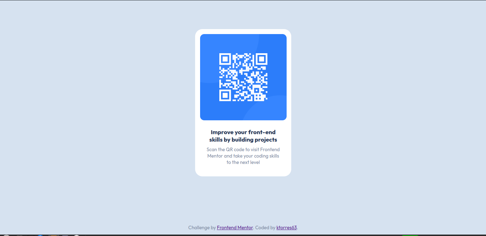

# Frontend Mentor - QR code component solution

This is a solution to the [QR code component challenge on Frontend Mentor](https://www.frontendmentor.io/challenges/qr-code-component-iux_sIO_H). Frontend Mentor challenges help you improve your coding skills by building realistic projects. 

## Table of contents

- [Overview](#overview)
  - [Screenshot](#screenshot)
  - [Links](#links)
- [My process](#my-process)
  - [Built with](#built-with)
  - [What I learned](#what-i-learned)
- [Author](#author)

## Overview

### Screenshot

### Links

- Solution URL: (https://github.com/ktorres63/qr-code-component)
- Live Site URL: (https://ktorres63.github.io/qr-code-component/)

## My process

### Built with

- Semantic HTML5 markup
- CSS custom properties
- Flexbox

### What I learned
I learned a little more about flexbox and a shortcut to create divs more quickly, you simply have to place .
 in the html file

## Author
- Frontend Mentor - [@ktorres63](https://www.frontendmentor.io/profile/ktorres63)
- Twitter - [@kt76850859](https://twitter.com/kt76850859)
